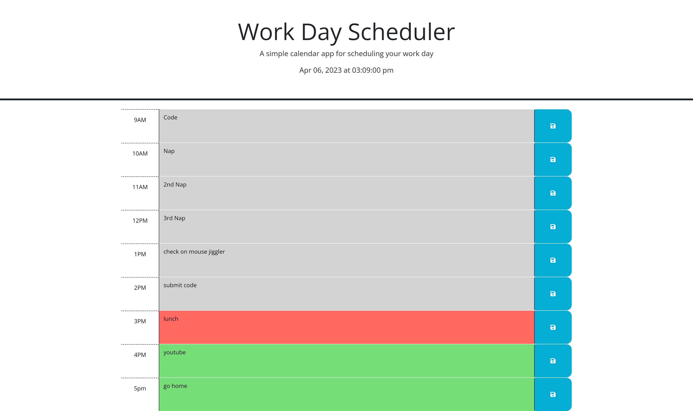

# Work-Day-Scheduler

## Description

I made this password generator to test my knowledge and skills in jquery. It also gave me a nice tool for structing my time around a 9-5 work schedule accurate to the current hour that I can later style or expand upon to implement in my daily life. I learned how to use jquery to create functions, call information from third party apis, use templetes from preset websites such as bootstrap, and call on parents siblings and other attributes of my html within my jquery for future manipulation.

## Installation

To deploy this code on your own head to the repository located here https://github.com/rocas3096/Work-Day-Scheduler. Once on the page, hit the code button and copy the repository using the https or ssh. Once complete open gitbash and head to your choosen directory where you wish to clone this code. When there, hit git clone then paste the link and the clone should copy to your local machine.

## Usage

To find this website, use this link. https://rocas3096.github.io/Work-Day-Scheduler/

To review this repository, use this link. https://github.com/rocas3096/Work-Day-Scheduler

## Credits
N/A

## License

N/A

---
